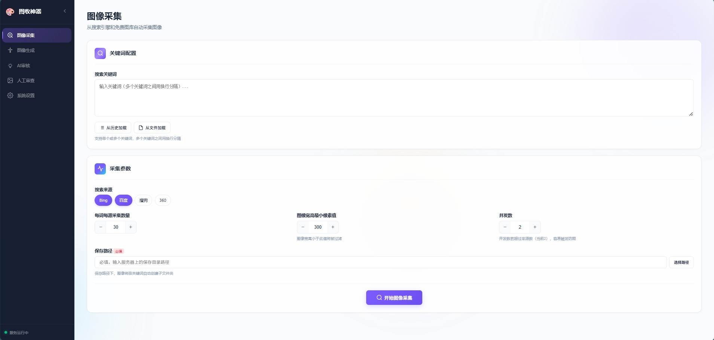
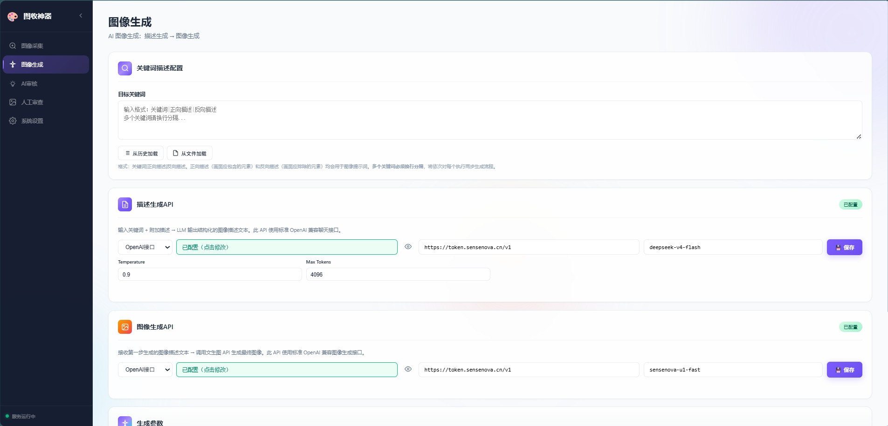

# 图收神器 (ImageGod)

<div align="left">


**AI 驱动的图像自动采集、生成与智能审核系统**

[](https://www.python.org/)
[](https://fastapi.tiangolo.com/)
[](https://www.langchain.com/)
[](LICENSE)

</div>

---

## 🚀 项目简介

**图收神器 (ImageGod)** 是一个面向特定场景（如安全巡检、质量检测等）的 AI 图像数据获取与管理平台。它集成了**多源图像采集**、**AI 图像生成**和**多模态智能审核**三大核心能力，提供完整的 Web UI 可视化操作界面。
文件约200M，无法上传github，保存在夸克网盘：
链接：https://pan.quark.cn/s/005a74366044
提取码：MRpp

### 典型应用场景

| 场景 | 关键词示例 |
|------|-----------|
| 安全巡检 | 配电箱堆放易燃物、电线裸露、消防通道堵塞 |
| 交通监控 | 行人闯红灯、车辆违停、电动车逆行 |
| 质量检测 | 产品表面缺陷、包装破损、标签缺失 |
| 数据采集 | 风景壁纸、动物图片、建筑摄影 |

---

## ✨ 核心功能

| 功能模块 | 说明 |
|----------|------|
| **多源图像采集** | 支持 4 个搜索引擎（Bing/百度/搜狗/360） |
| **AI 图像生成** | 基于双 Agent 流水线（描述生成 + 图像生成），支持批量并发 |
| **智能审核分拣** | 多模态视觉大模型自动审核，按相关性评分自动分拣到 pos/neg/del 目录 |
| **Web UI 操作** | 完整的前端界面，支持采集/生成/审核全流程可视化操作 |
| **WebSocket 实时日志** | 任务执行过程实时推送，进度透明可见 |
| **密码保护** | API Key 脱敏、AI 审核和人工审查功能带密码验证 |
| **图片去重** | 支持 MD5 + 感知哈希 (dHash) + 像素对比三种去重级别 |
| **反爬保护** | User-Agent 轮换、随机延迟、熔断重试等机制 |

---

## 📦 功能模块详解

### 1. 图像采集



从多个来源并行采集图片，支持关键词过滤、尺寸筛选和实时进度追踪。

#### 操作步骤

1. 在左侧面板输入关键词（可多个，用换行或逗号分隔），或点击 **「从文件加载」** 导入 `keywords.txt`
2. 选择搜索引擎源：Bing、百度、搜狗、360
3. 设置每个源采集数量（默认 30 张）和最小图片尺寸（默认 300px）
4. 点击 **「开始采集」** 按钮
5. 右侧区域会实时显示日志和采集进度

#### 采集来源对比

| 来源 | 速度 |
|------|------|
| Bing | ⭐⭐⭐ |
| 百度 | ⭐⭐⭐ |
| 搜狗 | ⭐⭐ |
| 360 | ⭐⭐ |

#### 文件输出结构

```
output/
└── {关键词}/
    └── unreviewed/       # 待审核的原始图片
        ├── bing_001.jpg
        ├── baidu_001.jpg
        └── pexels_001.jpg
```

---

### 2. 图像生成



采用 **两步式 AI 生成流水线**：先用大语言模型生成场景描述，再调用文生图模型生成符合描述的图片。

#### 工作流程

```
关键词 → DescriptionAgent → 图像描述文本
                            ↓
图像描述文本 → GenerationAgent → 生成的图片
```

#### 操作步骤

1. 在左侧面板填写**生成配置**：
   - **关键词**：图片主题
   - **描述模型**：用于生成图像描述的大模型（如 `qwen3.7-plus`）
   - **图像模型**：文生图模型（如 `sensenova-u1-fast`）
   - **生成数量**：每个描述生成的图片数量
   - **并发数**：同时生成的请求数（建议 2-5）
2. 点击 **「开始生成」**，系统会依次执行：
   - **Step 1**：调用描述模型生成图像描述
   - **Step 2**：调用图像模型并发生成图片
3. 实时显示生成日志和任务状态

---

### 3. AI 智能审核

利用多模态视觉大模型（如 `qwen-vl-plus`）对采集或生成的图片进行自动审核与分拣。

#### 审核流程

```
待审核图片 → MD5去重 → dHash去重 → 过滤检查（可选） → 相关性评分
                                                          ↓
                                      score ≥ 阈值 → pos/ (相关)
                                      score < 阈值 → neg/ (不相关)
                                      无效图片    → del/ (删除)
```

#### 操作步骤

1. **密码验证**：首次进入需输入访问密码
2. 选择待审核的目标目录（通常为 `output/{关键词}/unreviewed/`）
3. 配置审核参数：
   - **过滤要求**（可选）：额外的硬性筛选条件，如"广告、动漫图片"
   - **相关性阈值**：0.0 ~ 1.0，默认 0.6，越高表示审核越严格
   - **审核模型**：选择多模态视觉模型（如 `qwen-vl-plus`）
   - **并发数**：同时审核的图片数量
4. 点击 **「开始审核」**，系统自动将图片分拣到：

```
output/{关键词}/
├── pos/          # 审核通过（相关图片）
├── neg/          # 审核不通过（不相关图片）
└── del/          # 建议删除（不符合要求图片）
```

---

### 4. 人工审查

对 AI 审核结果进行人工复查确认。

---

### 关键词文件格式

`keywords.txt` 支持以下格式：

```
# 这是一行注释
配电箱堆放易燃物|配电箱前方堆放纸箱、塑料等易燃物品
行人闯红灯|行人无视红灯横穿马路

# 也可以只有关键词，不带描述
消防通道堵塞
```

- `#` 开头的行为注释行
- `|` 分隔关键词和描述要求
- 描述用于指导 AI 生成更精准的图像描述

---

## 📄 License

MIT License

---

<div align="center">
  <sub>Built with ❤️ by ImageGod Team</sub>
</div>
